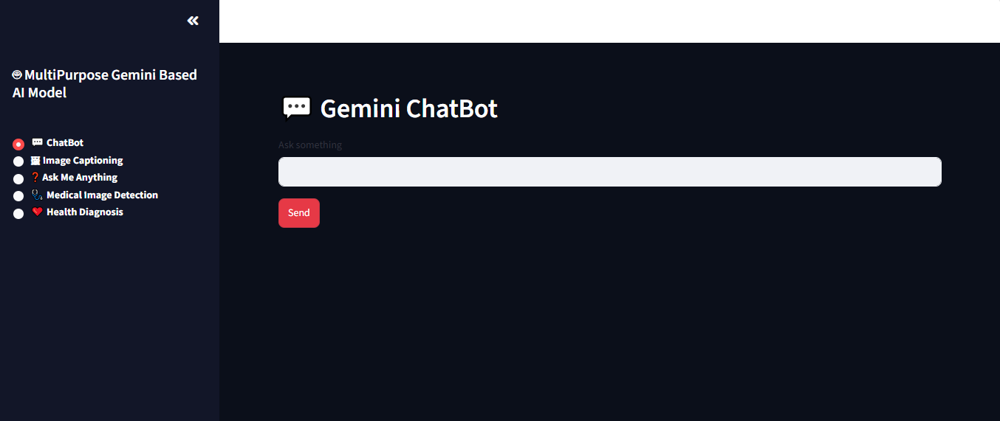
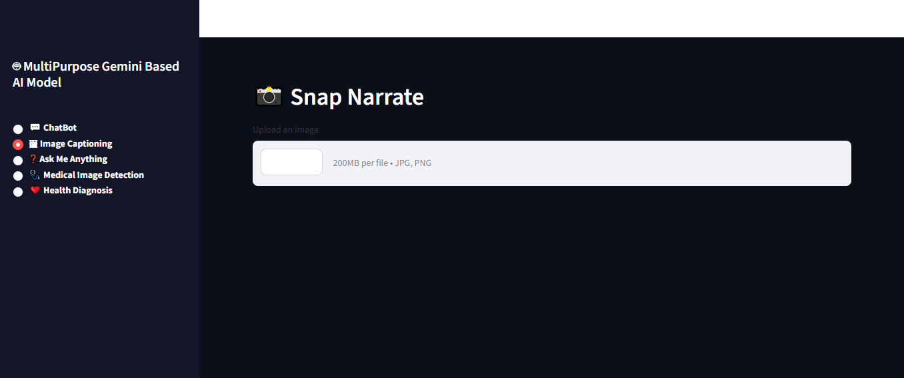
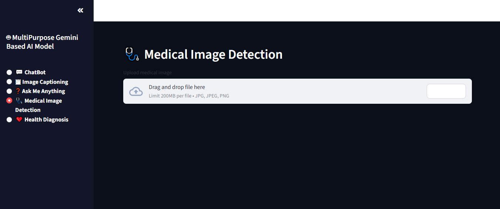
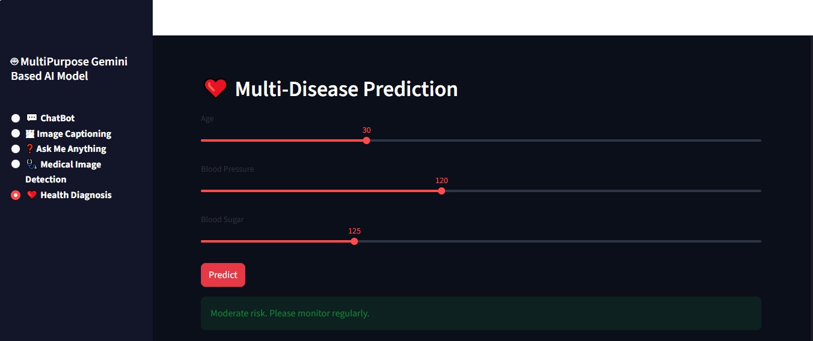

# 🤖 Multipurpose Gemini AI Chatbot

A multi-functional AI assistant built using Google's Gemini API and Streamlit. The application combines conversational AI, image understanding, medical image analysis, and health diagnosis tools into a single user-friendly interface.

---

## Features

### 💬 Gemini ChatBot

Interact with Google's Gemini model for general conversations, queries, and assistance.

### ❓ Ask Me Anything

Ask questions on any topic and receive AI-generated responses.

### 🖼 Image Captioning

Upload an image and generate a descriptive caption automatically.

### 🩺 Medical Image Detection

Analyze medical images and receive AI-powered observations.

### ❤️ Health Diagnosis

Provide health-related parameters such as age, blood pressure, and blood sugar levels to get a basic disease prediction.

---

## Tech Stack

* Python
* Streamlit
* Google Gemini API
* Pillow (PIL)
* NumPy

---

## Project Structure

```text
Multipurpose_Gemini_AI_Chatbot/
│
├── app.py
├── gemini_chatbot.py
├── image_captioning.py
├── medical_analysis.py
├── disease_detection.py
├── list_models.py
├── requirements.txt
│
└── README.md
```

---

## Installation

### Clone the Repository

```bash
git clone https://github.com/your-username/Multipurpose-Gemini-AI-Chatbot.git
cd Multipurpose-Gemini-AI-Chatbot
```

### Install Dependencies

```bash
pip install -r requirements.txt
```

### Configure Gemini API Key

Create a configuration file or environment variable containing your Gemini API key.

Example:

```python
GEMINI_API_KEY="YOUR_API_KEY"
```

### Run the Application

```bash
streamlit run app.py
```

---

## Application Modules

### ChatBot

Provides conversational AI support using Gemini.

### Image Captioning

Generates descriptions for uploaded images.

### Medical Image Analysis

Performs AI-assisted interpretation of medical images.

### Health Diagnosis

Uses user health parameters to generate disease prediction results.

---

## Future Improvements

* Voice Assistant Integration
* Medical Report Summarization
* User Authentication
* Chat History Storage
* Advanced Disease Prediction Models
* Deployment on Streamlit Cloud

---

## Screenshots

Add screenshots of:

* ChatBot Interface
  
  
* Image Captioning Module
  
  
* Medical Image Detection Module
  
  
* Health Diagnosis Module
  
  

---

## Author

Samriti

AI | Machine Learning | Python | Streamlit
